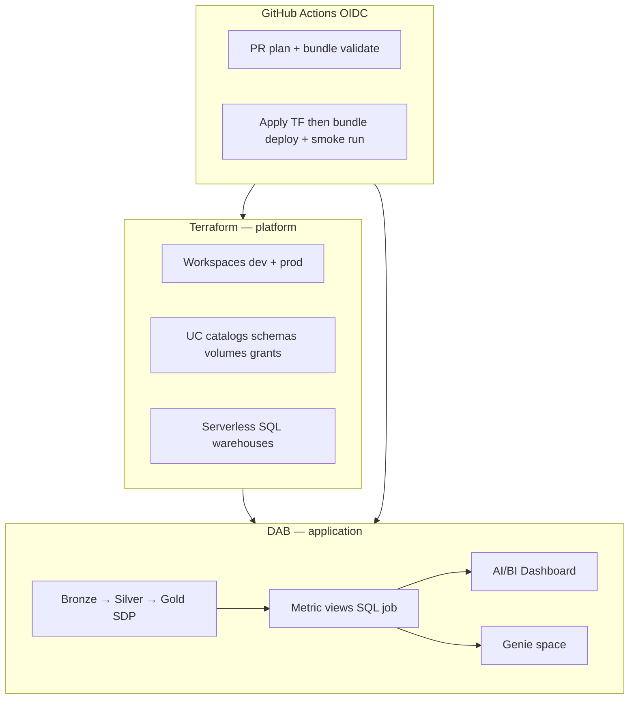

# Databricks client intake (template repo)

Orchestrate **conversation → architecture → questions → GO → new client repo**.

**On this template repo: do NOT open a PR** for client proposals or implementation.
The deliverable is `scripts/spawn-client-repo.sh` after the user says **GO**.

See `AGENTS.md` Mode A and [docs/CLIENT-REPO-BOOTSTRAP.md](../../../docs/CLIENT-REPO-BOOTSTRAP.md).

## Phase 0 — Do not code yet

On a request like *"Set up Databricks for client Hike2, dev + prod, full medallion
with SDP, metric view, dashboard, and Genie"*:

1. **Acknowledge scope** in one paragraph (platform + pipelines + consumption layer).
2. **Read** (before proposing):
   - `docs/ARCHITECTURE.md` — platform vs application split
   - `AGENTS.md` — agent boundaries
   - `.cursor/skills/databricks-bundles/SKILL.md`
   - `.cursor/skills/databricks-spark-declarative-pipelines/SKILL.md`
   - `.cursor/skills/databricks-metric-views/SKILL.md`
   - `.cursor/skills/databricks-dbsql/SKILL.md` (Liquid Clustering, managed tables)
3. **Do not** edit tfvars with client-specific names on `main`, run `terraform apply`,
   or `bundle deploy` unless the user explicitly overrides for a local session.

## Phase 1 — Architecture proposal (required output)

Produce a **Proposed architecture** section with:

### 1.1 Responsibility matrix (Terraform vs DAB)

| Concern | Terraform (slow, privileged) | DAB (fast, app-centric) |
|---------|------------------------------|-------------------------|
| Azure RG, workspace(s), UC metastore binding | ✓ | |
| Catalogs, schemas, volumes, external locations, grants | ✓ | optional overlap — prefer TF for platform |
| SQL warehouse(s), storage credentials | ✓ | |
| Bronze / silver / gold **tables** (ongoing) | bootstrap only | ✓ SDP pipelines |
| Ingestion & transforms | | ✓ SDP + jobs |
| Metric views | | ✓ SQL job task (`WITH METRICS LANGUAGE YAML`) — no native DAB resource |
| AI/BI dashboards | | ✓ `dashboards:` + `.lvdash.json` |
| Genie spaces | | ✓ `genie_spaces:` + `.geniespace.json` (CLI 1.3+, `engine: direct`) |
| SQL alerts, quality monitors | | ✓ DAB resources |
| CI smoke tests | | ✓ `bundle run` after deploy |

### 1.2 Reference topology (adapt per client)

```text
Azure subscription(s)
├── Terraform state (shared RG + storage account)
├── dev:  rg-hike2-dev  → dbw-hike2-dev  → UC catalog hike2_dev  (bronze/silver/gold schemas)
├── prod: rg-hike2-prod → dbw-hike2-prod → UC catalog hike2_prod (bronze/silver/gold schemas)
└── GitHub: OIDC → plan on PR, apply on merge / deploy workflow + slug sandboxes

Bundle (per repo or mono-repo bundle/)
├── pipelines: bronze_ingest → silver_clean → gold_curated   (SDP, serverless)
├── jobs: metric_view_ddl, optional backfill
├── metric views: gold KPIs (SQL task)
├── dashboards: executive.lvdash.json
└── genie_spaces: analyst.geniespace.json (over gold / metric views)
```

### 1.3 Mermaid (include in proposal)



### 1.4 Best-practice callouts (cite ai-dev-kit)

Always mention applicable practices from `docs/ARCHITECTURE.md` §2, e.g.:

- Two Terraform layers + separate state (10-infra / 20-platform)
- Catalog = environment boundary; schema = domain (bronze/silver/gold or sales)
- Serverless SDP + serverless SQL warehouse
- Managed Delta + Liquid Clustering on gold
- Bundle variables for catalog / schema / warehouse_id across targets
- OIDC in CI, no long-lived secrets
- Genie requires **direct** bundle engine (note CI CLI version implication)

### 1.5 Phased delivery plan (after spawn — on **client repo**)

| Phase | Contents | Where |
|----|----------|-------|
| GO | Spawn repo + platform deploy | Agent runs `spawn-client-repo.sh` |
| PR 1 | SDP bronze/silver/gold skeleton | **Client repo** |
| PR 2 | Metric view SQL job | Client repo |
| PR 3 | Dashboard + Genie | Client repo |
| PR 4 | CI smoke test extensions | Client repo |

### 1.6 Persist the proposal (working tree — not template PR)

1. Copy `_TEMPLATE.md` to `docs/architecture-proposals/<client-slug>-<scope>.md` **locally**.
2. Fill sections; `status: draft` until user approves.
3. **Do not** open a PR on the template repo with client-specific content.
4. On **GO**, `spawn-client-repo.sh` copies the proposal into the **new client repo**.

## Phase 2 — Clarifying questions (required)

Use **AskQuestion** when available; otherwise numbered list. Group by theme.
**Do not implement until must-have questions are answered** (or user says "use defaults for demo").

### Must-have (block architecture)

1. **Workspace topology**: Two physical workspaces (dev + prod) vs one workspace with dev/prod **catalogs**? (Cost vs isolation trade-off.)
2. **Azure**: Region(s), one subscription or dev/prod subscriptions?
3. **Identity**: Entra groups for admins vs engineers (`account users` ok for demo only?)
4. **GitHub**: For greenfield clients → **new repo from template on GO** (see
   `client-repo-go` skill). Template repo stays generic; client repo gets names + proposal.
5. **Naming**: Client slug for resources and repo (e.g. `meridian` → `meridian-databricks`, `dbw-meridian`).

### Should-have (shape the medallion demo)

6. **Data source**: Built-in `samples.*`, synthetic (Faker), or client file landing zone?
7. **Domain**: Generic retail/sales vs client-specific entity names?
8. **SDP scope**: Batch medallion only, or include streaming table / CDC example?
9. **Gold metrics**: Which KPIs for the metric view (counts, revenue, ratios)?
10. **Dashboard audience**: Executive summary vs analyst exploration?

### Nice-to-have (consumption layer)

11. **Genie**: Instructions / sample questions — generate from UI template or greenfield JSON?
12. **Alerts**: SQL alert on pipeline freshness or row-count anomaly?
13. **CI**: Run full SDP on every deploy or notebook smoke test only (cost/time)?

### Defaults when user says "demo" or "use defaults"

- Region: `eastus2`
- One workspace + catalog per slug (spawn creates dedicated client repo)
- `account users` for grants
- `samples.nyctaxi.trips` or synthetic sales data
- Serverless everywhere
- Metric view: order/trip count + revenue measures
- Genie over gold table + metric view

## Phase 3 — Proposal review (before GO)

1. Present architecture in chat; write proposal file under `docs/architecture-proposals/`.
2. **On the template repo:** keep client-specific proposal **off `main`** until GO
   (working tree, draft branch, or unmerged PR). The template stays a neutral showcase.
3. When user approves, set proposal `status: approved` in the file (can happen at GO time).

## Phase 4 — GO (spawn client repo + deploy) — **required next step**

When the user says **GO** or approves the proposal (including "yes deploy", "create the repo", "ship it"):

1. **Stop** — do not open a PR on the template repo.
2. Follow `.cursor/skills/client-repo-go/SKILL.md`.
3. Run spawn scripts with `CLIENT_SLUG` and `PROPOSAL_FILE`.
4. Report the new repo URL and Actions deploy link.

## Phase 5 — Implementation (on client repo, after deploy)

1. User connects Cursor to the **client repo** (e.g. `meridian-databricks`).
2. Update proposal `status: approved` in that repo if not done at spawn.
3. Implement **one PR slice** at a time; offline Terraform tests per `AGENTS.md`.
4. Open PRs on the **client repo**; CI plans and applies via OIDC.
5. Babysit until green.

## Example opener (Hike2)

> **Proposed architecture for Hike2** — dual-catalog medallion on shared Azure footprint,
> Terraform for workspaces/UC/warehouses, DAB for SDP + metric view + dashboard + Genie.
> Five PRs suggested. Before PR 1, please confirm: (1) two workspaces vs two catalogs,
> (2) region, (3) GitHub repo/OIDC status.

## Anti-patterns

| Do not | Do instead |
|--------|------------|
| Open a PR on **template** for client work | Intake in chat → GO → spawn |
| Commit client names to **template** `main` | Names live in client repo only |
| Put metric views in Terraform | SQL job in bundle |
| Deploy Genie on legacy TF bundle engine | `engine: direct` + CLI 1.3+ |
| Single PR for TF + SDP + Genie | Phased PRs per table above |
| Skip smoke test | `bundle run` after deploy in CI |

## Related skills

Invoke as needed during implementation:

- `databricks-bundles`, `databricks-spark-declarative-pipelines`
- `databricks-metric-views`, `databricks-dbsql`, `databricks-jobs`
- `databricks-unity-catalog`, `databricks-config`
