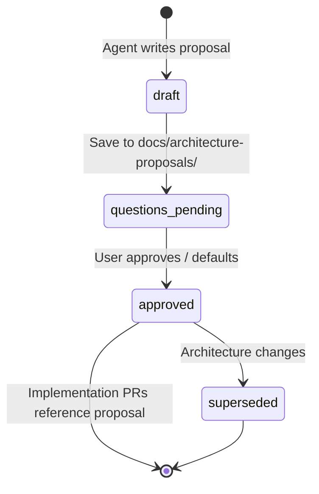

# Architecture proposals

Git-tracked **architecture decision records** for greenfield client engagements.
The Cursor cloud agent writes these **before** implementation PRs (Option C intake).

## Why this exists

- **Audit trail** — what was agreed, when, and why (interviews, client handoffs).
- **Separation** — proposal PR can land before Terraform/bundle code PRs.
- **Reusable template** — same structure for every client; `main` stays generic.

## Lifecycle

| Status | Meaning |
|--------|---------|
| `draft` | Initial proposal from agent; questions may be open |
| `questions-pending` | Written to disk; waiting on user answers |
| `approved` | User confirmed decisions; agent may open implementation PRs |
| `superseded` | Replaced by a newer file (link in frontmatter) |



## File naming

```
docs/architecture-proposals/<client-slug>-<short-scope>.md
```

Examples:

- `hike2-medallion-full-stack.md`
- `acme-analytics-pilot.md`

Use lowercase slugs (alphanumeric + hyphens). Copy from [`_TEMPLATE.md`](_TEMPLATE.md).

## Agent workflow

1. **Intake** — follow [`.cursor/skills/databricks-client-intake/SKILL.md`](../.cursor/skills/databricks-client-intake/SKILL.md).
2. **Write proposal** — fill template; set `status: draft` or `questions-pending`.
3. **Open PR** (optional but recommended) — *"Add architecture proposal for &lt;client&gt;"* only;
   no Terraform/bundle changes yet.
4. **Update** — after user answers, set `status: approved`, fill **Decisions** and
   **Open questions** (resolved).
5. **Implement** — each implementation PR links to the approved proposal path in
   its description.

## What not to put here

- Secrets, subscription IDs, tenant IDs, storage account names that must stay private
  → use GitHub Environment variables per [DEMO-SETUP.md](DEMO-SETUP.md).
- Generated Terraform plans or large JSON exports.

## Example

See [`examples/hike2-medallion-full-stack.example.md`](examples/hike2-medallion-full-stack.example.md)
(fictional client — illustration only, not deployed).
