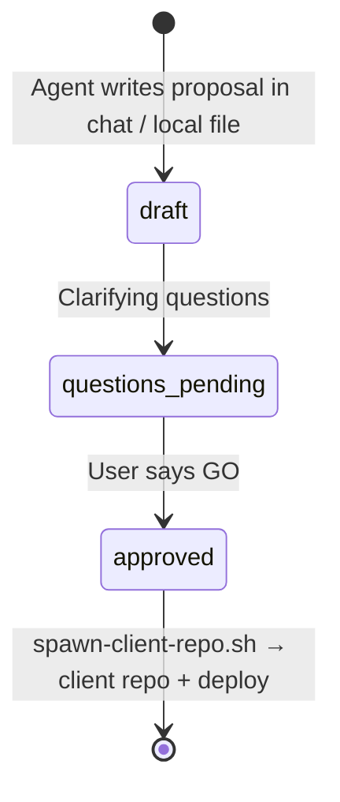

# Architecture proposals

Git-tracked **architecture decision records** for greenfield client engagements.
On the **template** repo, proposals stay in the agent working tree until **GO**;
`spawn-client-repo.sh` copies them into the **new client repo**.

## Why this exists

- **Audit trail** — what was agreed, when, and why (reviews, client handoffs).
- **Separation** — proposal reviewed in chat; platform ships via spawn + deploy, not a template PR.
- **Reusable template** — `main` here stays generic; client names live in client repos.

## Lifecycle

| Status | Meaning |
|--------|---------|
| `draft` | Initial proposal from agent; questions may be open |
| `questions-pending` | Written locally; waiting on user answers |
| `approved` | User said GO; agent runs `spawn-client-repo.sh` |
| `superseded` | Replaced by a newer file (link in frontmatter) |



## File naming

```
docs/architecture-proposals/<client-slug>-<short-scope>.md
```

Examples:

- `hike2-medallion-full-stack.md` (see `examples/` only)
- `acme-analytics-pilot.md`

Use lowercase slugs. Copy from [`_TEMPLATE.md`](_TEMPLATE.md).

## Agent workflow (template repo)

1. **Intake** — [`.cursor/skills/databricks-client-intake/SKILL.md`](../.cursor/skills/databricks-client-intake/SKILL.md).
2. **Write proposal** — local file; `status: draft`. **Do not PR to template `main`.**
3. **GO** — [`.cursor/skills/client-repo-go/SKILL.md`](../.cursor/skills/client-repo-go/SKILL.md) → new repo + deploy.
4. **Implement** — PRs on the **client repo** only; link the proposal in each PR.

## What not to put here

- Secrets, subscription IDs, tenant IDs, storage account names that must stay private
  → use GitHub Environment variables per [DEMO-SETUP.md](DEMO-SETUP.md).
- Generated Terraform plans or large JSON exports.

## Example

See [`examples/hike2-medallion-full-stack.example.md`](examples/hike2-medallion-full-stack.example.md)
(fictional client — illustration only, not deployed).
