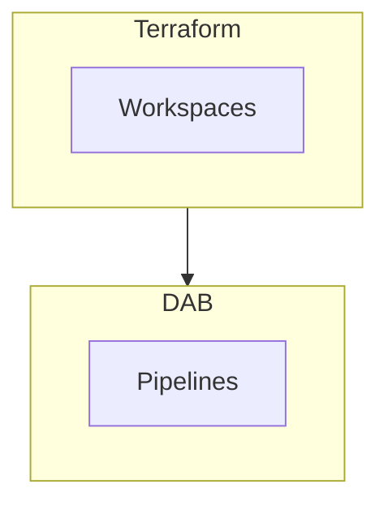

# <Title>

## Request

<!-- Verbatim or summarized user ask -->

## Proposed architecture

### Terraform vs DAB

| Concern | Terraform | DAB |
|---------|-----------|-----|
| | | |

### Topology

```text
<!-- ASCII diagram: workspaces, catalogs, state keys, CI -->
```

### Diagram



### Best practices applied

<!-- Bullet list with refs to INTERVIEW.md / ai-dev-kit -->

## Decisions

<!-- Fill when approved. Use "TBD" until user confirms. -->

| Topic | Decision | Rationale |
|-------|----------|-----------|
| Workspace topology | TBD | |
| Azure region | TBD | |
| Dev / prod model | TBD | |
| Client slug | TBD | |
| Data source (medallion) | TBD | |
| Identity / grants | TBD | |
| GitHub / OIDC | TBD | |
| Bundle engine | TBD | direct if Genie |

## Open questions

<!-- Numbered; move to Decisions when resolved -->

1.

## Phased delivery (PR plan)

| PR | Scope | Depends on |
|----|-------|------------|
| 1 | | proposal approved |
| 2 | | PR 1 |

## GitHub runtime configuration

<!-- Names only — values live in GitHub Environment, not in repo -->

| Variable / secret | Purpose |
|-------------------|---------|
| `WORKSPACE_NAME` | |
| `CATALOG_NAME` | |

## Risks and out of scope

-

## Approval

- [ ] User reviewed architecture
- [ ] Open questions resolved or explicitly defaulted
- [ ] Ready for implementation PR 1

**Approved by:**  
**Date:**
