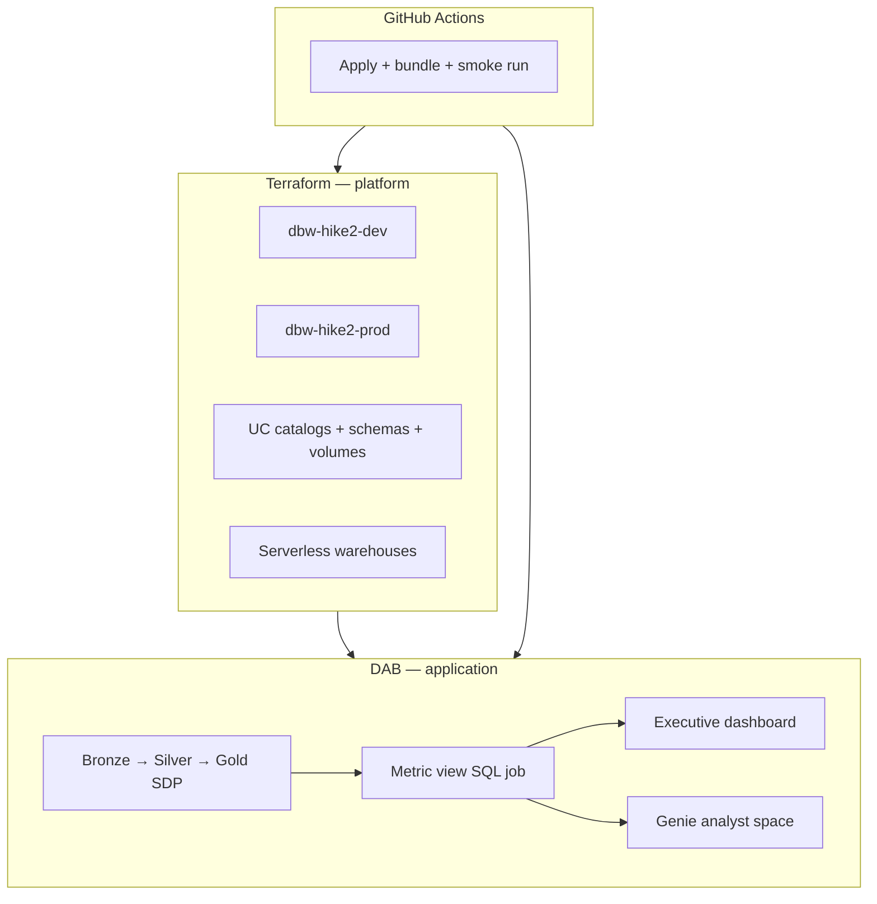

# Hike2 — full medallion + consumption layer (example)

> **This file is an illustration** of a completed intake proposal. It is not a
> deployed client environment. Copy `_TEMPLATE.md` for real engagements.

## Request

Set up Databricks for client **Hike2**: dev and prod, demo of full medallion
architecture (SDP), Unity Catalog metric view, AI/BI dashboard, and Genie space.
Hands-off deploy via GitHub Actions OIDC.

## Proposed architecture

### Terraform vs DAB

| Concern | Terraform | DAB |
|---------|-----------|-----|
| Azure RG, workspaces, UC metastore | ✓ | |
| Catalogs `hike2_dev` / `hike2_prod`, bronze/silver/gold schemas | ✓ | |
| Landing volume, SQL warehouses, grants | ✓ | |
| Bronze → silver → gold tables (ongoing) | bootstrap only | ✓ SDP |
| Metric views | | ✓ SQL job (`WITH METRICS LANGUAGE YAML`) |
| AI/BI dashboard | | ✓ `.lvdash.json` |
| Genie space | | ✓ `.geniespace.json`, `engine: direct` |
| CI smoke test | | ✓ `bundle run` after deploy |

### Topology

```text
Azure (single subscription — example)
├── State: rg-tfstate / sttfdbx<org> / databricks/hike2-{env}/
├── dev:  rg-hike2-dev  → dbw-hike2-dev  → catalog hike2_dev  (bronze, silver, gold)
├── prod: rg-hike2-prod → dbw-hike2-prod → catalog hike2_prod (bronze, silver, gold)
└── GitHub OIDC → terraform apply → bundle deploy → sample pipeline run

bundle/
├── pipelines/hike2_medallion/     # SDP serverless
├── jobs/metric_views_ddl/
├── resources/dashboard.yml
└── resources/genie_space.yml      # requires CLI 1.3+, direct engine
```

### Diagram



### Best practices applied

- Two Terraform layers + separate state per env (`10-infra`, `20-platform`)
- Platform (TF) vs application (DAB) split per `docs/INTERVIEW.md`
- Serverless SDP and serverless SQL warehouse
- Gold: managed Delta + Liquid Clustering
- Bundle variables: `catalog`, `schema`, `warehouse_id` per target
- OIDC CI — no long-lived secrets in Cursor or repo
- Client-specific **values** in GitHub Environment vars, not committed tfvars

## Decisions

| Topic | Decision | Rationale |
|-------|----------|-----------|
| Workspace topology | **Two workspaces** (dev + prod) | Strong isolation for client demo |
| Azure region | `eastus2` (pending confirm) | Align with template repo |
| Dev / prod model | Physical workspace per env | User asked dev + prod |
| Client slug | `hike2` | From request |
| Data source | `samples.nyctaxi.trips` for pilot | Zero ingest setup; swap later |
| Identity / grants | TBD — Entra groups vs `account users` | Demo vs production-like |
| GitHub / OIDC | Fork template; bootstrap per DEMO-SETUP | Reuse workflows |
| Bundle engine | `direct` when Genie added | Genie not on TF engine |

## Open questions

1. Confirm **eastus2** or another region?
2. Entra group names for `ADMIN_GROUP` / `DATA_ENGINEER_GROUP`?
3. Executive dashboard vs analyst dashboard emphasis?
4. Run full SDP on every CI deploy, or lightweight smoke job only?
5. Separate GitHub Environment `hike2-prod` or single `production` with vars?

## Phased delivery (PR plan)

| PR | Scope | Depends on |
|----|-------|------------|
| 0 | This proposal (example) | — |
| 1 | Terraform: dual-env module inputs + `resolve-deployment` for `hike2` | Approved |
| 2 | SDP medallion pipeline + demo source | PR 1 |
| 3 | Metric view SQL job over gold | PR 2 |
| 4 | Dashboard + Genie (`engine: direct`) | PR 3 |
| 5 | CI: pipeline smoke run + docs runbook | PR 4 |

## GitHub runtime configuration

Document in client runbook; do not commit values.

| Variable | Purpose |
|----------|---------|
| `WORKSPACE_NAME` | `dbw-hike2-prod` (prod env) |
| `CATALOG_NAME` | `hike2_prod` |
| `STATE_*` | Shared state backend |
| `ADMIN_GROUP` / `DATA_ENGINEER_GROUP` | UC grants |

## Risks and out of scope

- Globally unique storage account names require human pick at bootstrap
- Genie UI drift — use `bundle generate genie-space` before redeploy
- Two workspaces ≈ 2× workspace SKU cost vs catalog-only isolation
- Out of scope: private link, IP access lists, customer-managed keys

## Approval

- [ ] User reviewed architecture
- [ ] Open questions resolved or explicitly defaulted
- [ ] Ready for implementation PR 1

**Approved by:** _(example — not approved)_  
**Date:**
