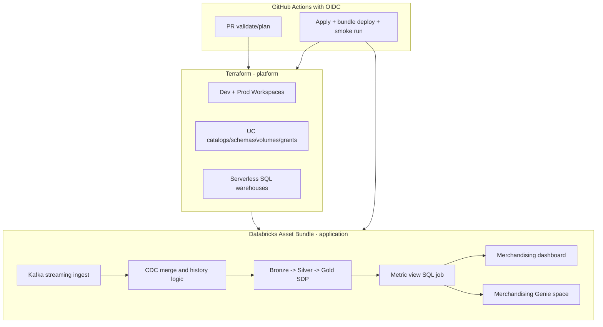

# Meridian Retail - medallion + merchandising consumption layer

## Request

Onboard Meridian Retail with:
- Dev and prod Databricks workspaces in `eastus2`
- Medallion architecture including Kafka streaming ingestion and CDC
- A governed metric view
- A merchandising dashboard
- A Genie space for merchandising analysts
- Entra group `meridian-data-engineers`
- Proposal-first workflow (proposal-only PR before implementation)

## Proposed architecture

### Terraform vs DAB

| Concern | Terraform | DAB |
|---------|-----------|-----|
| Azure resource groups + Databricks workspaces (dev/prod) | ✓ | |
| Unity Catalog bindings, catalogs, schemas, volumes, grants | ✓ | optional overlap; prefer TF for platform baseline |
| Serverless SQL warehouses | ✓ | |
| Bronze/silver/gold table lifecycle | bootstrap only | ✓ Lakeflow SDP pipelines |
| Kafka ingestion and CDC transforms | | ✓ SDP streaming tables + CDC flows |
| Metric view definition and deployment | | ✓ SQL job task (`WITH METRICS LANGUAGE YAML`) |
| Dashboard deployment | | ✓ dashboard resource (`.lvdash.json`) |
| Genie space deployment | | ✓ genie space resource (`.geniespace.json`, direct engine) |
| CI smoke run after deploy | | ✓ bundle run job/pipeline |

### Topology

```text
Azure (target: eastus2)
├── Terraform state (shared backend, separate state keys per layer and env)
├── dev
│   ├── rg-meridian-dev
│   ├── dbw-meridian-dev
│   └── Unity Catalog objects
│       └── catalog: meridian_dev
│           ├── bronze
│           ├── silver
│           └── gold
└── prod
    ├── rg-meridian-prod
    ├── dbw-meridian-prod
    └── Unity Catalog objects
        └── catalog: meridian_prod
            ├── bronze
            ├── silver
            └── gold

bundle/
├── pipelines/meridian_medallion/        # Kafka -> bronze -> silver -> gold (CDC)
├── jobs/metric_view_refresh/            # Metric view DDL/refresh orchestration
├── resources/merch_dashboard.yml        # AI/BI dashboard
└── resources/merch_genie_space.yml      # Genie over gold + metric view
```

### Diagram



### Best practices applied

- Keep privileged platform concerns in Terraform (`10-infra` and `20-platform`) and app concerns in DAB (`bundle/`).
- Use separate Terraform state per layer/environment so `20-platform` can consume applied output from `10-infra`.
- Use serverless Lakeflow SDP and serverless SQL warehouse by default.
- Model environment boundary at catalog level (`meridian_dev`, `meridian_prod`) with bronze/silver/gold schemas per catalog.
- Keep money and KPI fields in `DECIMAL`, and use managed Delta + Liquid Clustering for gold-layer performance.
- Parameterize bundle targets with environment-specific `catalog`, `schema`, and `warehouse_id`.
- Use GitHub Actions OIDC (no long-lived cloud secrets committed to repo).
- Use bundle direct engine when introducing Genie resources.

## Decisions

| Topic | Decision | Rationale |
|-------|----------|-----------|
| Workspace topology | Two physical workspaces (dev + prod) | Explicit user requirement for dev and prod workspaces |
| Azure region | `eastus2` | Explicit user requirement |
| Dev / prod model | Separate workspace plus separate catalog per environment | Strong environment isolation + clean governance boundaries |
| Client slug | TBD (`meridian` vs `meridian-retail`) | Needed for repo/resource naming consistency |
| Data source (medallion) | Kafka streaming with CDC | Explicit user requirement; topic and payload details pending |
| Identity / grants | Include `meridian-data-engineers` as engineer group | Explicit user requirement; admin/consumer groups still needed |
| GitHub / OIDC | Use existing OIDC CI model in this repo template | Aligns with repo standards and no static secrets |
| Bundle engine | `direct` when Genie resources are deployed | Required for Genie resource support |

## Open questions

### Must-have (blocks implementation PR 1)

1. Confirm client slug and naming standard: should we use `meridian` or `meridian-retail` for repo/resource prefixes?
2. Azure subscription layout: one shared subscription for dev+prod, or separate subscriptions per environment?
3. Identity model: what Entra group should be platform/admin owner in addition to `meridian-data-engineers`?
4. Should access also be granted to a read-only analyst/BI group for dashboard and Genie consumption? If yes, what group name?
5. Confirm GitHub environment strategy: reuse `production` or create Meridian-specific environments (for example `meridian-dev`, `meridian-prod`)?

### Should-have (shapes medallion design)

6. Kafka source details: Kafka platform (Event Hubs Kafka API / Confluent / self-managed), auth mechanism, and topic naming.
7. CDC contract: primary keys, operation column (`I/U/D`), event timestamp ordering column, and SCD target behavior (Type 1 vs Type 2 per entity).
8. Domain model scope for merchandising: which core entities are in-scope first (inventory, price, promotion, store, product, vendor, sales)?
9. Metric view KPI set: confirm initial KPIs (for example sales, gross margin, sell-through, stockout rate, markdown rate, promo lift).
10. Dashboard audience priority: executive summary only, analyst drill-down, or both in first release?

### Nice-to-have (consumption and operations)

11. Genie behavior: preferred semantic instructions, guardrails, and any disallowed question domains.
12. SLA and freshness expectations for pipeline, metric view refresh, and dashboard updates.
13. Data quality controls needed in v1 (null thresholds, duplicate checks, late-arrival tolerance, alert routing).

## Phased delivery (PR plan)

| PR | Scope | Depends on |
|----|-------|------------|
| 0 | This architecture proposal only (`docs/architecture-proposals/meridian-medallion-merchandising.md`) | — |
| 1 | Terraform updates for dual Meridian workspaces/catalogs, grants, warehouse, and environment variable wiring | Proposal approved |
| 2 | DAB Lakeflow medallion skeleton with Kafka streaming ingestion and CDC flow definitions | PR 1 |
| 3 | Gold contract + metric view SQL job + permissions | PR 2 |
| 4 | Merchandising dashboard + Genie space resources and baseline prompts | PR 3 |
| 5 | CI smoke execution path (bundle run) + runbook docs for runtime config | PR 4 |

## GitHub runtime configuration

Values live in GitHub Environments; names only are tracked in docs.

| Variable / secret | Purpose |
|-------------------|---------|
| `LOCATION` | Azure region input (`eastus2`) |
| `DEPLOYMENT_SLUG` | Isolated deployment naming for Meridian sandbox/prod |
| `ADMIN_GROUP` | Platform/admin Unity Catalog group |
| `DATA_ENGINEER_GROUP` | Set to `meridian-data-engineers` |
| `CATALOG_NAME` | Environment-specific catalog name |
| `WORKSPACE_NAME` | Environment-specific workspace name |
| `WAREHOUSE_NAME` | SQL warehouse name for dashboard/Genie |

## Risks and out of scope

- Kafka connectivity/networking and private endpoints are not designed in this proposal (can be added in an infrastructure hardening phase).
- CDC quality depends on source ordering guarantees and key correctness; these must be validated before production cutover.
- Genie and dashboard quality depend on semantic modeling and KPI definition quality in gold and metric views.
- Out of scope in proposal PR: `terraform plan/apply`, bundle deploy/run, and any cloud-side provisioning.

## Approval

- [ ] User reviewed architecture
- [ ] Open questions resolved or explicitly defaulted
- [ ] Ready for implementation PR 1

**Approved by:**  
**Date:**
